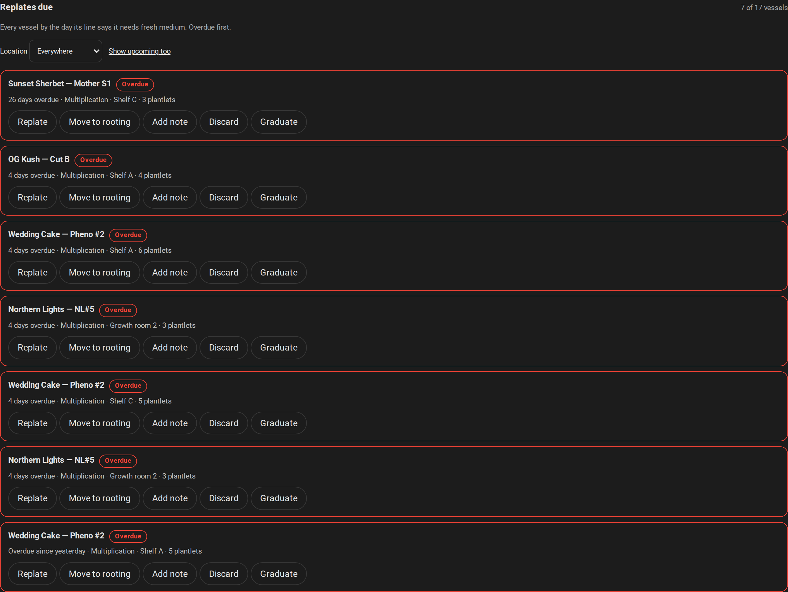
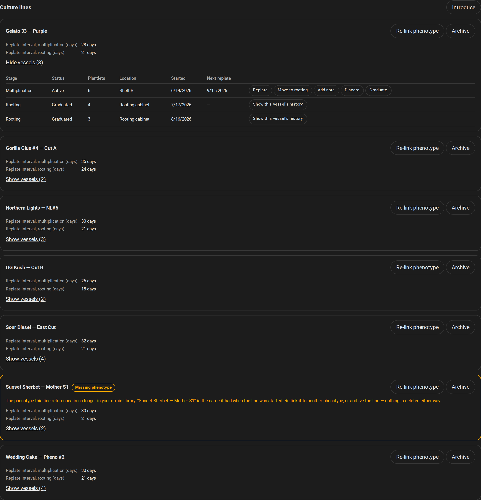
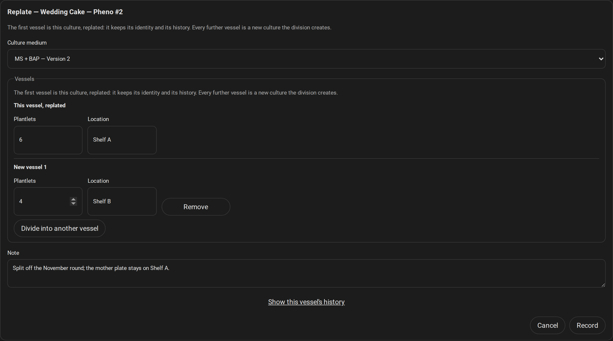
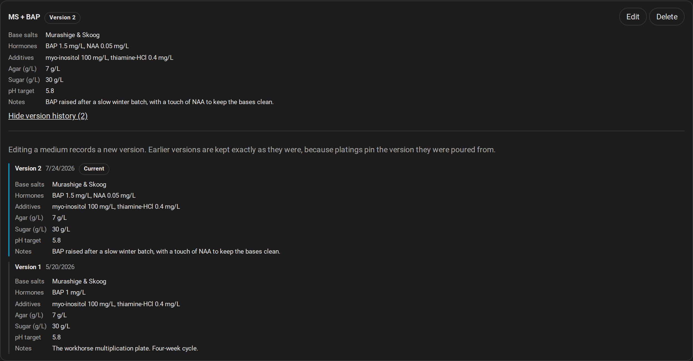
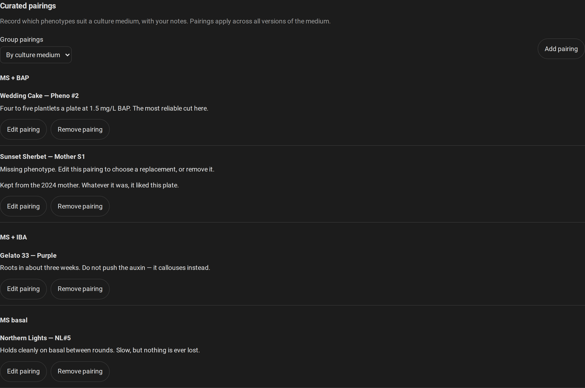
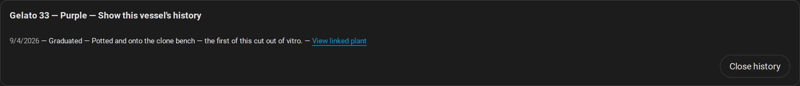
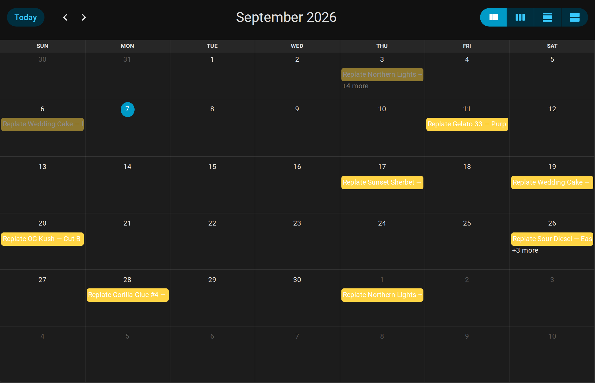

# Growspace Manager TC

[](https://github.com/Venosta-web/growspace_manager_tc/actions/workflows/lint.yaml)
[](https://github.com/Venosta-web/growspace_manager_tc/actions/workflows/tests.yaml)
[](https://github.com/Venosta-web/growspace_manager_tc/actions/workflows/validate.yaml)
[](https://codecov.io/gh/Venosta-web/growspace_manager_tc)

The optional tissue-culture companion to
[Growspace Manager](https://github.com/Venosta-web/growspace_manager). Keep a
phenotype alive in Culture Lines, work the replate list the way you would work
a bench, hold your Culture Medium recipes with their history intact, record
which phenotype does well on which medium, and hand a rooted vessel back to
Growspace Manager as a plant.


_Every live vessel carries a Replate Due Date — its last act plus the interval
its Culture Line sets for the stage that vessel is on. The card opens on the
ones that have come round, overdue first, with the five Maintenance Actions on
each._

## Requirements

- Home Assistant **2026.8.1 or newer** and HACS **2.0.5 or newer**.
- **Growspace Manager installed, configured, and loaded** in the same Home
  Assistant instance. TC borrows the phenotypes in its strain library and never
  owns them, so it does not run on its own: setup refuses with an explanation
  when Growspace Manager is not there, and waits for it if it goes away later.
- The [Growspace Manager card](https://github.com/Venosta-web/lovelace-growspace-manager-card),
  **v1.3.0-next.59 or later**, which carries the TC view. That is a prerelease,
  so turn prereleases on for it in HACS. TC does not install the card for you,
  and the card is where the whole TC surface lives — the integration serves one
  calendar entity and nothing else.

## Install through HACS

1. **Install and configure Growspace Manager first**, and give it something to
   work with: one phenotype in its strain library, and a growspace with a free
   position for a graduated culture to land in.
2. In HACS, open the three-dot menu and choose **Custom repositories**. Add
   `https://github.com/Venosta-web/growspace_manager_tc` with the category
   **Integration**.
3. Find **Growspace Manager TC**, download it, and restart Home Assistant.
   Until the first GitHub release is published HACS offers the `main` branch,
   which is what you want; afterwards pick the release you want from the
   [changelog](CHANGELOG.md).
4. Go to **Settings → Devices & services → Add integration** and add
   **Growspace Manager TC**. There is nothing to fill in, and one entry is all
   the integration supports.
5. Download or update the Growspace Manager card through HACS, then put its TC
   card on a dashboard. It takes no options, so the manual card editor is
   enough:

   ```yaml
   type: custom:growspace-tc-card
   ```

   The TC view ships inside that one card package as a chunk it fetches only
   when it finds TC running — there is no second frontend repository to add,
   and on an instance without TC the card renders nothing at all.

TC needs no YAML, no cloud account, and no key. HACS talks to GitHub to install
and update it; everything the integration itself does is local. To update,
download the version you want in HACS and restart — and keep Growspace Manager
and the card on versions that match, since the three move together.

## Your first culture loop

1. **Introduce a line.** Pick a phenotype from Growspace Manager, say whether
   the first vessel is in multiplication or rooting, and set the replate
   interval for each stage. Record the Plantlet Count and a Location if you
   keep them. Introduction creates the Culture Line and its first Culture in
   one act.
2. **Prepare a Culture Medium.** Name the formulation and record its base
   salts, additives, hormones, agar, sugar and target pH. Editing it never
   rewrites what came before: each change forks a new, immutable Medium
   Version, so a Replate from last month still points at the recipe it
   actually used.
3. **Work from the worklist.** The TC card opens on what is due and what is
   overdue. Replate a Culture onto a chosen Medium Version and record the
   Plantlet Count and Location of every vessel that comes out of it. One vessel
   carries the Culture forward; the rest become new Cultures in the same line.
4. **Record what happens between replates.** Add a note, move a Culture to
   rooting, or discard it with a reason. Nothing is deleted — an ended Culture
   and its history stay readable. A Replate moves the due-date anchor; moving
   to rooting leaves the anchor alone and only changes which interval applies
   to it. Before the first Replate, the Introduction is the anchor.
5. **Curate pairings.** Endorse a phenotype and a Culture Medium together, with
   your notes. The by-medium and by-phenotype views are two readings of the
   same set, not two lists to keep in step. A Pairing endorses the medium
   across all its versions; pinning a version is what a Replate does.
6. **Graduate.** End a Culture, and optionally create the plant in Growspace
   Manager at the same time by choosing its destination and genetics. It enters
   as a clone, and the graduation record keeps the plant's ID. Declining the
   plant, or a call that fails, still leaves the graduation recorded — the
   Culture has ended either way and nothing is lost. If the link is missing,
   look in Growspace Manager before adding a plant by hand: a call can fail
   after creating one, so TC does not retry it for you.

## The calendar, missing phenotypes, and your data

TC adds **one calendar entity** per config entry, carrying the Replate Due Date
of every live vessel. Use it in the calendar panel or as an automation trigger.
Overdue work shows there and on the card; there are deliberately no separate
overdue alert entities to disagree with it.

A phenotype removed from Growspace Manager does not take its Culture Line with
it. The line stays visible under the name TC snapshotted, and you can either
re-link it to another phenotype or archive it. TC never deletes a line because
the thing it referred to went away.

Records live in Home Assistant's `.storage` directory, so they are already in
your normal Home Assistant backups. Do not edit the store while Home Assistant
is running.

If setup says Growspace Manager is missing, check that it is actually _loaded_
and not merely downloaded in HACS — HACS installing files and Home Assistant
setting an integration up are two different things. If TC is missing from the
card, check that its entry is loaded, that the card is new enough, and reload
the dashboard.

## Screenshots

### Culture Lines and their vessels

A Culture Line is one phenotype, borrowed from Growspace Manager and never
owned by TC. The vessels standing under it are its Cultures, each on a stage
with its own replate interval. The highlighted line is a **Missing phenotype**:
what it referenced has left the strain library, so the line keeps the name it
snapshotted when it was started and offers a re-link or an archive. Nothing is
deleted because something it pointed at went away — and the two graduated
vessels are still there to read.



### A Replate, which is also a division

A Replate pins the Medium Version it was poured from, so last month's plating
still points at the recipe it actually used rather than at today's. The first
vessel out of it _is_ this Culture, replated — same identity, same history.
Every further vessel is a new Culture in the same line. Recording it moves the
line's due-date anchor; moving a vessel to rooting does not, and only changes
which interval applies.



### Culture Media, and why editing one forks it

Editing a medium never rewrites what came before. Each change records a new
immutable Medium Version, so Version 1 stays exactly what it was on the day
something was plated onto it — which is the only reason a Replate's pin means
anything a year later.



### Curated Pairings

A Pairing endorses a phenotype and a Culture Medium together, with your notes.
It applies across every version of that medium — pinning one version is what a
Replate does, not what a Pairing does. Grouping by medium and grouping by
phenotype are two readings of the same set rather than two lists to keep in
step, and a pairing whose phenotype has left the strain library says so instead
of vanishing.



### A graduation that crossed back

Graduating ends a Culture and keeps its history. It can also create the plant
in Growspace Manager, through that integration's own public service, and the
graduation record then holds the plant's ID — the link below. A graduation
whose bridge declined or failed is recorded just the same, with no link, because
the Culture has ended either way and TC does not retry it for you.



### The replate calendar

One calendar entity carries the Replate Due Date of every live vessel, for the
calendar panel or as an automation trigger. Overdue work shows there and on the
card; there are deliberately no separate overdue entities that could disagree
with it.



---

## V1 boundaries

V1 is Culture Lines and Cultures, the five Maintenance Actions, stage-based
Replate Due Dates, one calendar, Plantlet Counts, free-text Locations,
immutable Medium Versions, curated Pairings, and the optional graduation into a
plant.

Derived pairing statistics, TC import/export, overdue alert or binary sensor
entities, and a structured location hierarchy are **not** in V1 — each for a
reason recorded in the [scope](docs/v1-scope.md). The
[WebSocket contract](docs/websocket-contract.md) is the surface the card talks
to, and [release verification](docs/release-readiness.md) is how the HACS
install of this version was checked.

## Development and branding

[AGENTS.md](AGENTS.md) has the worktree and validation commands,
[CONTEXT.md](CONTEXT.md) the vocabulary, and [docs/adr/](docs/adr/) the
decisions and why they went that way.

The brand assets under `custom_components/growspace_manager_tc/brand/` are the
Growspace Manager set, reused unchanged — both repositories are the same
author's, under the same MIT [licence](LICENSE).
Home Assistant's own `brands` component reads that directory for a custom
integration before it asks the brands CDN, so the icon appears without a
submission to the `home-assistant/brands` repository — which is why the HACS
validation workflow ignores its `brands` check on purpose.
